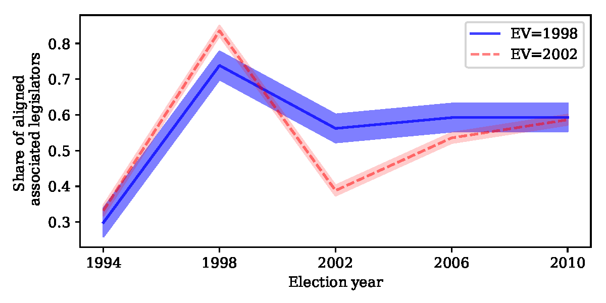

# Cold Bacon: Co-Partisan Politics in Brazil
(with [Rodrigo Schneider](https://sites.google.com/view/rodrigoaraujoschneider))

> **Current Version:** [June 2020](/coldbacon.pdf)

> **Status:** Forthcoming, **_Public Choice_**

> **Presentations:** 
> * SEA 90th Annual Meeting - [Programme](https://www.southerneconomic.org/session-details/?conferenceId=6&participantId=20528)

> **Abstract:** This paper provides evidence of alignment effects between the executive and legislative branches of the central government. We use detailed data on Brazilian intergovernmental grants whose allocations are determined by legislators. The executive branch cannot interfere with the destiny and volume of grants, but it can control the transfer pace. We group the data into municipalities and estimate the effects of the share of aligned legislators associated with a municipality on the average time to receive grants. We show that legislators politically aligned to the executive branch transfer resources to their constituencies nine months faster than unaligned legislators. To achieve a causal interpretation of these results, we use an exogenous variation in the share of elected aligned legislators caused by the phased-in introduction of electronic voting. Our findings regarding how political alignment affects the speed of transfer are consistent across different periods and alternative definitions of the dependent variable.

